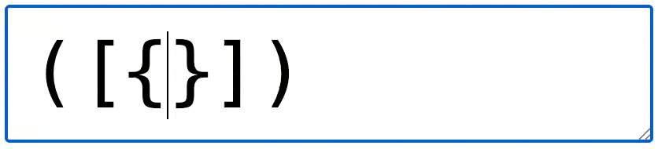
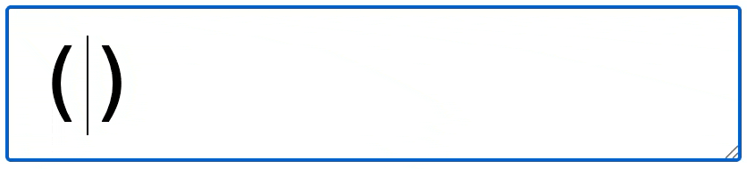

# autopair.js

Lightweight autopairing + typethrough behavior for HTML `input[type=text]` and `textarea`. No dependencies. Preserves the undo/redo stack.

## Features

1. Automatically closes parentheses, brackets, curly braces, single quotes, and double quotes.

   

2. Wraps selected text. For example, selecting a word and hitting `(` will wrap the word in parentheses.

   

3. Atomically removes pairings. For example, when hitting backspace inside `()`, both characters are removed.

   

4. Types through closing characters. For example, hitting `)` in front of an already typed `)` simply moves the cursor past it.

   

## Installation

```bash
npm install autopair
```

## Usage

```html
<textarea id="editor"></textarea>

<script type="module">
  import autopair from '/path/to/autopair.js';

  // Use the autopair module
  const textarea = document.getElementById('editor');

  // Autopair with default pairings:
  // '(': ')',
  // '[': ']',
  // '{': '}',
  // "'": "'",
  // '"': '"'
  autopair(textarea);

  // When defining custom pairings, include the defaults
  autopair(textarea, {
    '(': ')',
    '[': ']',
    '{': '}',
    "'": "'",
    '"': '"',
    '‘': '’', // Curly quotes
    '“': '”',
    '*': '*' // For markdown italics
  });
</script>
```

## Development

Run a webserver and open `index.html`.
