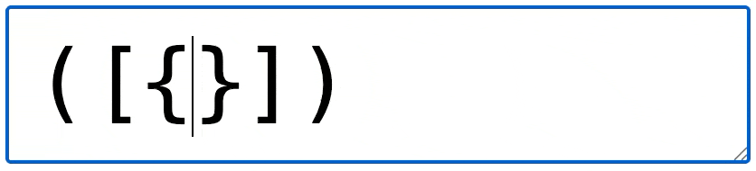
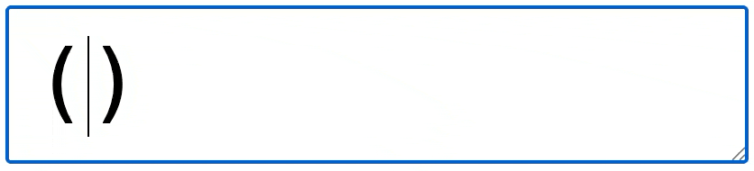

# autopair.js

Lightweight autopairing + typethrough behavior for HTML `input[type=text]` and `textarea`. No dependencies. Preserves the undo/redo stack.

Behaves like Sublime Text's auto-pairing in Markdown mode.

## Features

1. Automatically closes parentheses, brackets, curly braces, single quotes, double quotes, and backticks.

   

2. Wraps selected text. For example, selecting a word and hitting `(` will wrap the word in parentheses. Asterisks and underscores only wrap selected text; they are not closed automatically.

   

3. Atomically removes pairings. For example, when hitting backspace inside `()`, both characters are removed.

   

4. Types through closing characters. For example, hitting `)` in front of an already typed `)` simply moves the cursor past it.

   

## Installation

```bash
npm install autopair
```

## Usage

```html
<textarea id="editor"></textarea>

<script type="module">
  import autopair from '/path/to/autopair.js';

  // Use the autopair module
  const textarea = document.getElementById('editor');

  // Autopair with default pairings:
  // '(': ')',
  // '[': ']',
  // '{': '}',
  // "'": "'",
  // '"': '"',
  // '`': '`',
  // '*': '*',
  // '_': '_'
  autopair(textarea);

  // When defining custom pairings, include the defaults
  autopair(textarea, {
    '(': ')',
    '[': ']',
    '{': '}',
    "'": "'",
    '"': '"',
    '`': '`',
    '*': '*',
    '_': '_',
    '‘': '’', // Curly quotes
    '“': '”'
  });

  // Teardown, ie remove autopair.js functionality from an element
  let teardown = autopair(textarea);
  teardown();
</script>
```

## Contributing

Report issues on the [Veritula issue tracker](https://veritula.com/discussions/autopair-js). Do not submit issues on GitHub.

## Bug bounty program

There’s a [Veritula bug bounty program](https://veritula.com/bounties/10) for autopair.js. Report bugs there, not on GitHub.

## Development

Run a webserver and open `index.html`.
